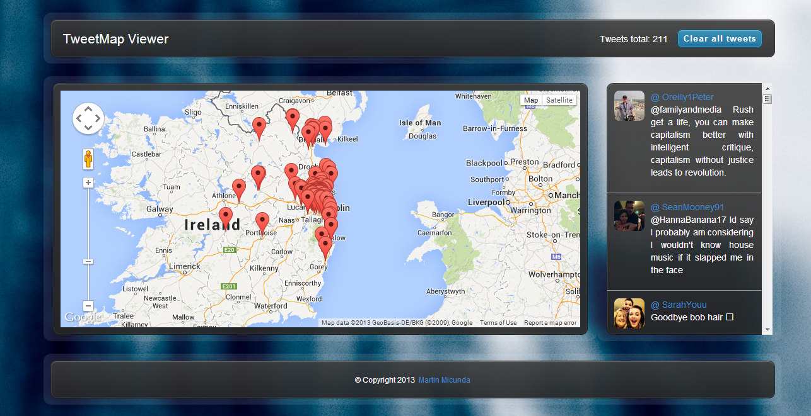

[](http://travis-ci.org/martinmicunda/tweet-map) [](https://david-dm.org/martinmicunda/tweet-map) [](https://david-dm.org/martinmicunda/tweet-map#info=devDependencies) [](http://gruntjs.com/) [](https://bitdeli.com/free "Bitdeli Badge")
TweetMap 
=========

A Node.js, ExpressJS and AngularJS responsive webapp which generates a real-time heatmap of the most recent 1000 Irish tweets on a google map in real time. This is a node.js application that uses twitter public stream api with a filter criteria.

[Click here to see it in action!](http://tweet-map.herokuapp.com/)



## Technologies Used

* **Client Side:**
    * [AngularJS](http://angularjs.org/)
    * [HTML5](http://www.w3.org/TR/2011/WD-html5-20110525/)
    * [CSS3](http://www.w3.org/TR/2001/WD-css3-roadmap-20010523/)
    * [Bootstrap 3](http://getbootstrap.com/)
    * [Google Map API v3](https://developers.google.com/maps/)

* **Server Side:**
    * [NodeJS](http://nodejs.org/)
    * [ExpressJS](http://expressjs.com/)
    * [Jade](http://jade-lang.com/)
    * [Stylus](http://learnboost.github.io/stylus/)
    * [Socket.IO](http://socket.io/)
    * [Twitter API v1.1](https://dev.twitter.com/)

* **Development & Deployment:**
    * [Grunt](http://gruntjs.com/)
    * [Bower](http://bower.io/)
    * [Travis CI](https://travis-ci.org/)

* **Test:**
    * [Jasmine](http://pivotal.github.io/jasmine/)
    * [Karma](http://karma-runner.github.io/)
    * [Protractor](http://github.com/angular/protractor/)
    * [Selenium](http://www.seleniumhq.org/)
    * [Sauce Lab](http://saucelabs.com/)

## Installation & Configuration

### Platform & tools

You need to install Node.js and then the development tools. Node.js comes with a package manager called [npm](http://npmjs.org) for installing NodeJS applications and libraries.
* [Install node.js](http://nodejs.org/download/) (requires node.js version >= 0.8.0)
* [Install Grunt](http://gruntjs.com/) as global npm modules (requires node.js version >= 0.8.0):

    ```
    npm install -g grunt-cli
    ```

* [Install Bower](http://http://bower.io/) as global npm modules (requires node.js version >= 0.8.0):

    ```
    npm install -g bower
    ```
    
### App
Run the following commands to download TweetMap app:
    ```
    git clone https://github.com/martinmicunda/tweet-map.git
    ```

* Install local dependencies (navigate to tweet-map directory):

    ```
    cd tweet-map
    npm install
    ```

*Note1: If you are getting error with github try this "git config --global url."https://".insteadOf git://".* <br />
*Note2: Make sure all 3rd dependencies from package.json and bower.json are isntalled on your local machine.*

### Configure Twitter API
Go to [dev.twitter.com](https://dev.twitter.com/apps/new) and register an application. A set of keys will be created for you and you have to add them to [development.json](https://github.com/martinmicunda/tweet-map/blob/master/server/src/app/config/env/development.json) file.
``` javascript
"twitter": {
    "consumerKey": "",
    "consumerSecret": "",
    "accessTokenKey": "",
    "accessTokenSecret": ""
}
```

## Running App

### Start the Server
* Run the server (the command will automatically opens web browser)

    ```
    node app.js
    ```

* Browse to the application at [http://localhost:3000](http://localhost:3000)

## License
The MIT License (MIT)

Copyright (c) 2013 Martin Micunda

Permission is hereby granted, free of charge, to any person obtaining a copy of
this software and associated documentation files (the "Software"), to deal in
the Software without restriction, including without limitation the rights to
use, copy, modify, merge, publish, distribute, sublicense, and/or sell copies of
the Software, and to permit persons to whom the Software is furnished to do so,
subject to the following conditions:

The above copyright notice and this permission notice shall be included in all
copies or substantial portions of the Software.

THE SOFTWARE IS PROVIDED "AS IS", WITHOUT WARRANTY OF ANY KIND, EXPRESS OR
IMPLIED, INCLUDING BUT NOT LIMITED TO THE WARRANTIES OF MERCHANTABILITY, FITNESS
FOR A PARTICULAR PURPOSE AND NONINFRINGEMENT. IN NO EVENT SHALL THE AUTHORS OR
COPYRIGHT HOLDERS BE LIABLE FOR ANY CLAIM, DAMAGES OR OTHER LIABILITY, WHETHER
IN AN ACTION OF CONTRACT, TORT OR OTHERWISE, ARISING FROM, OUT OF OR IN
CONNECTION WITH THE SOFTWARE OR THE USE OR OTHER DEALINGS IN THE SOFTWARE.
